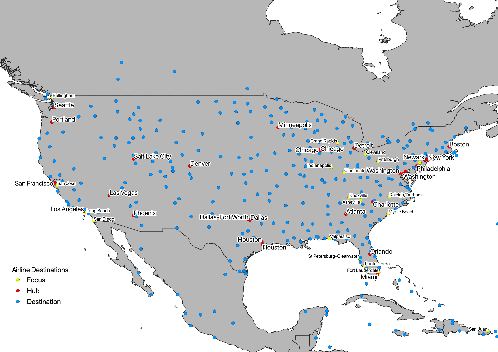
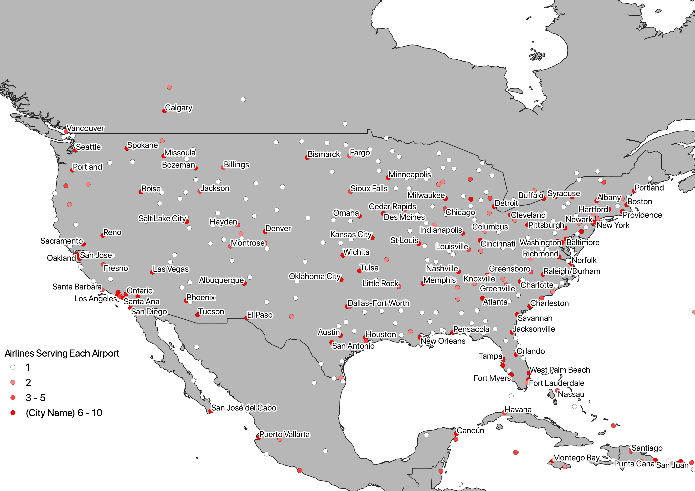

# Single United States Airline
Workbook that combine tables of destinations reached by several airlines into a single table, which is then used to generate a map of destinations.

## Data Manipulation

`airline_destination_data` workbook completes the following steps:
* Combines separate airline tables into a single table of desinations, showing only airport ICAO code.
* Joins airline destinations with a table containing name and coordinate data of all airports.
* Includes a table notating hubs and focus cities.
* Creates a table of airports with columns showing which airline reaches each airport (Y/N).

## Maps

The resultant table is then fed into QGIS to produce the attached map, showing each airport by how many airlines reach said airport. QGIS Map and shapefiles are saved in the `geodata` folder.

### Hubs and Focus Cities

### Number of Airlines Serving Each Airport

## Gathered Data and Sources

* Airline Destinations (`airline_destination_data/*.csv`) - [Wikipedia](https://en.wikipedia.org/)

* Airline hubs (`airline_destination_data/hubs/hubs.csv`) - [Wikipedia](https://en.wikipedia.org/)

* Airports (`geodata/airports.csv`) - [datahub.io](https://datahub.io/core/airport-codes)

* Shapefile downloaded from [ArcGIS Hub](https://hub.arcgis.com/datasets/a21fdb46d23e4ef896f31475217cbb08_1)
